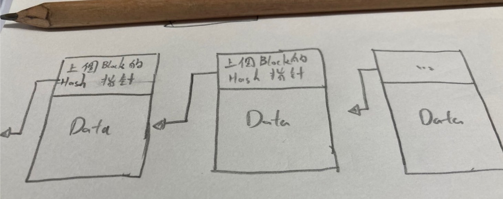
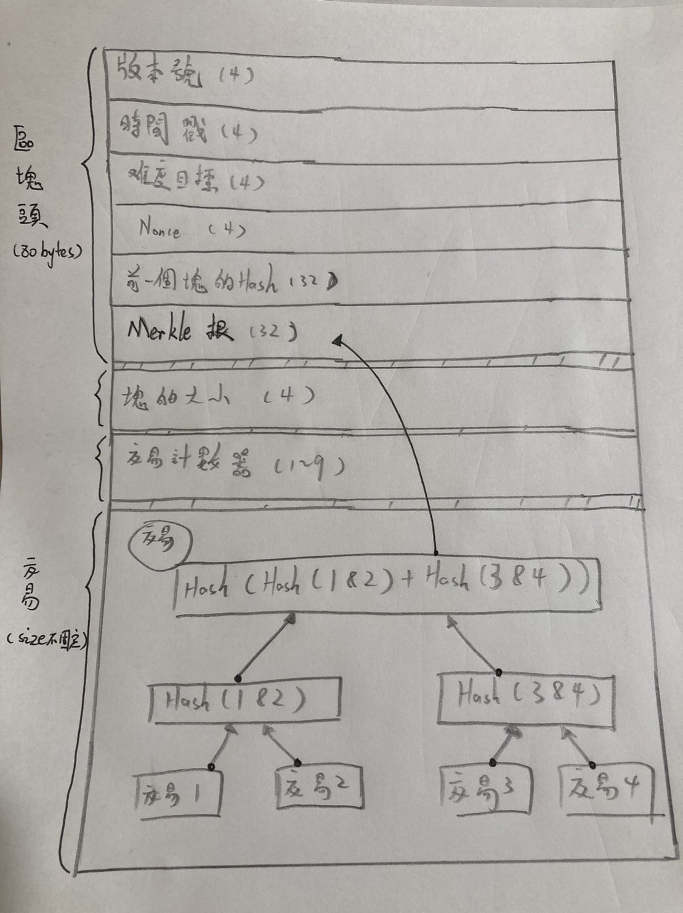

# BitCoin blockchain 的 block 裡面長怎樣？

<br>

---

<br>

比特幣區塊鏈是這樣把“塊”鏈起來的：




每一個塊都有一個地方是存上一個塊的 hash 指針，可以知道上一個塊是誰（逆向 linked list）。

<br>

一個塊中，具體有以下內容（假設開區塊共``有4筆交易）：



<br>

4 個主要體說明：

| 主體   |      bytes      |  說明 |
|----------|:-------------:|------:|
| 區塊頭 |  80 | 具體內容看下面表 |
| 塊大小 |    4   |   記錄這個 bytes 開始後面區塊的大小 |
| 交易計數器 | 1~9 |    區塊中的交易量 (每個區塊第一筆交易叫做 Coinbase 交易)  |
| 交易 | unknown |    交易資料  |

<br>

__區塊頭內容__

| 段落   |      bytes      |  說明 |
|----------|:-------------:|------:|
| 版本號 |  4 | 塊的版號 |
| 時間戳記 |    4   |   塊的產生時間 |
| 難度目標 | 4 |  [POW](https://academy.binance.com/zt/articles/proof-of-work-explained) 算法難度目標  |
| Nonce | 4 |    滿足難度目標而設定的隨機數  |
| 前一個區塊的 Hash 值 | 32 |  ...  |
| Merkle 根 | 32 |  區塊中的交易資料結構是 [Merkle tree](https://zh.wikipedia.org/zh-tw/%E5%93%88%E5%B8%8C%E6%A0%91)，這一個段落紀錄這個塊的交易根 hash，他的作用是快速歸納與驗證區塊資料的存在與完整性 |

<br>

比特幣使用 SHA-256 算法計算區塊摘要。看上面的交易區塊裡面的交易範例，Merkle 根是由所有交易資料一路用 SHA-256 算上來得到的值。這樣算 Merkle 根的意義在於一但區塊中的交易資料被算改，在驗證 Merkle 時就會發現不對勁。

Merkle Tree 是一個 Binary Tree，我認為他更像是 B+ 數（看這篇筆記的人，我假設你知道 Binary Tree 是什麼...）：

* 葉節點：存放交易資料。
* 枝節點：存放子節點的 Hash 值。
* 根節點：包含整個區塊中所有交易算出的 Hash（有人偷偷改其中一筆交易描述，都會改變跟節點運算結果，只要知道原本正確的根，就不怕有人偷改）

Merkle Tree 的特性是：

* 底層葉子節點的資料有變動，都會傳遞到枝節點，再到根節點，從而影響最終的 Merkle 根的資料。
* 他必須是滿 Binary Tree，也就是除葉子節點以外，每一層節點都必須有 2 個子節點: 

    這樣不行：
    ```
        X
      |   |
      X    

    ```

    這樣可以：
    ```
        X
      |   |
      X   Ｘ 
    ```
    
    這就要求一個區塊中的交易數量必須是偶數，如果剛好是奇數筆交易，則通常會複製最後一筆交易來湊滿偶數。