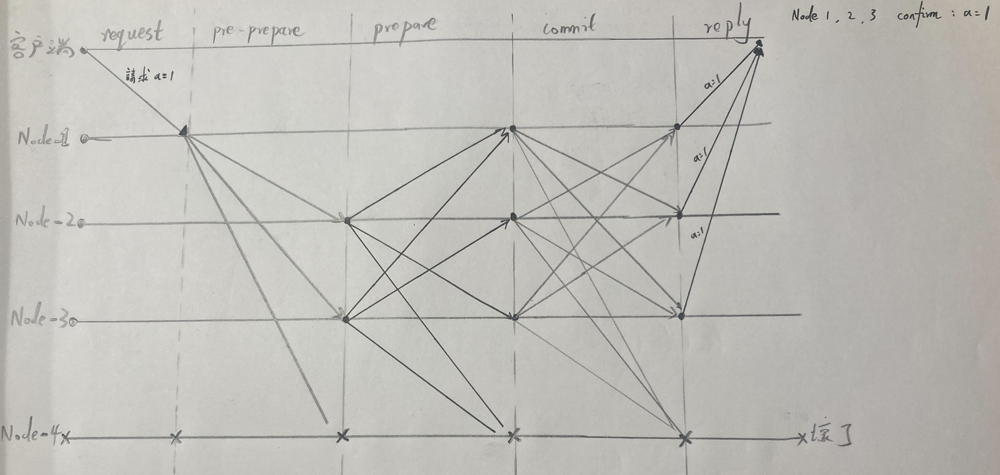

# 拜占庭問題與共識算法 (區塊鏈技術)

 

---

 

## 拜占庭將軍問題與共識算法

 

比特幣系統是一個去中心化的 __分布式系統__，分佈在世界各地的礦工要參與記帳。

因此所有礦工之間要型成共識，防止礦工記帳時作假。共識算法就是解決這一問題而發明。實現不同節點上資料一致性與正確性。

拜占庭將軍問題簡單說明就是古時候通訊不發達，一支軍隊各個將軍分別率領著扎在不同營地，他們之間如果要協商在同時間發起進攻，就需要互相派出傳令兵奔走相告。

如果超過半數將軍決定進攻，那大家就簡單多數決，發起進攻。反之則按兵不動。

假設一個場景，一共有 7 個將軍分佈在各地，3 個人決定進攻，3 個人決定按兵不動。剩下一個將軍是叛徒，他向三個要進攻的將軍們說支持進攻，同時向按兵不動的將軍們說按兵不動。那再發進進攻的當下，3 個將軍將出兵，3 個將軍不出兵。結果就是兵敗如山倒。

拜占庭將軍問題並不是實際存在，而是由電腦科學家 Leslie Lamport 在 1982 年提出。該問題就是在討論上述問題該如何解決，在少量節點作惡的情況下，意見如何達成一致。

> Refs: [拜占庭将军问题是什么？区块链如何防范恶意节点？](https://www.bilibili.com/video/BV1yJ411v7xV/?spm_id_from=333.337.search-card.all.click&vd_source=9780a181ac9f1fee5f680f255ee5bc73) -- 李永樂老師 

 

拜占庭將軍問題解決方案是 BFT(Byzantine Fault Tolerance) 算法。

假設將軍總人數為 N，叛徒將軍人數為 B，忠誠將軍人數為 G1，忠誠但是通信失敗的將軍人數為 G2，要滿足以下兩點才能形成有效共識：

1. 忠誠且通訊沒問題的將軍數量 > 叛徒將軍：G1 > B
2. 忠誠的且通訊沒問題的將軍必須比通訊故障的多：G1 > G2

其實可以將 G2 當作 B，又因為 `G1 = N - G2 - B` 所以 G1 > B 可以替換成表達式：

    N - B - B > B

也就等於

    N > 3B

既叛徒將軍不超過總人數 1/3 時， BFT 生效。

 
 
 
 

## 共識流程推演

 

共識流程一共有 5 個階段 

    Request -> Pre-Prepare -> Prepare -> Commit -> Reply

 

### 假設情境：

有一個客戶端，有 4 個分布式節點，裡面有一個壞掉的節點不會有任何行為。

客戶端（大領主）發一個請求 (進攻命令) 給其中一個節點（某個將軍），這個節點會把開訊息通知所有其他節點（所有將軍），經過共識算法推演讓大家取得共識後，所有人 reply 最終達成的共識。

看圖說故事：

 

時序是從左到右，從客戶端發起 request 開始，到各個節點 reply confirm 結束。

 

1. __request 階段__：客戶端向其中一個節點 Node-1 發起 a=1 消息。

 

2. __pre-prepare 階段__：Node-1 收到消息後，向所有節點廣播 a=1 消息。

 

3. __prepare 階段__：其他節點收到消息後，各自都向其他節點廣播一次 a=1 消息。(Node-1 作為第一個廣播者也會收到)

 

4. __commit 階段__：所有節點一起再執行一次廣播行為。

    4-1: commit 結束後每個節點都會收到最多 N-1 條消息（扣掉自己），當然，這個範例中 Node-4 掛了，所以每個節點只會收到 2 條

    4-2: 收到 2 條消息後，如果這兩條消息都是 a = 1，那證明一切都好，大家都是好寶寶，但如果有一條是 a = 999，另一條是 a = 1，那該節點就無法判斷並 confirm 消息，最終導致無法進行下一步 reply。

     

5. __reply__: 各個有效節點各自確認消息後，進行最終 reply。

    如果多數節點都發生類似 4-2 的無法確認消息的話，會導致客戶端無發收到足夠數量且正確的 reply，最終就是意味著上鏈失敗。
    
    之後就看客戶端要不要重新上鏈。

