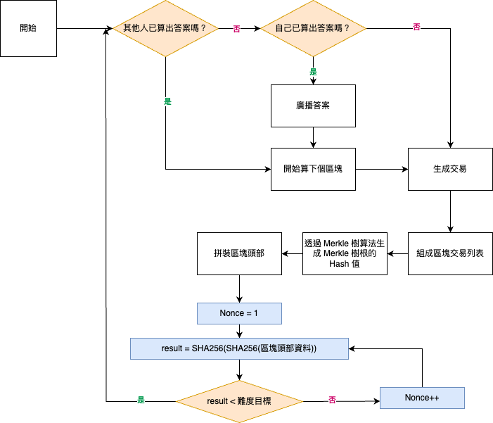

# 挖礦是什麼 ?

<br>

---

<br>

## 礦工是誰？他們賺什麼？

礦工區塊鏈網路中就是節點（套用上一個章節的拜占庭將軍問題，礦工們也可以視為不同的 “將軍”）。

在 bitcoin 系統中，共識算法解決了 2 個問題:

* 確定計帳節點(礦工)。
* 確定計帳資料在區塊鏈網路中的正確性與一致性。

<br>

__bitcoin 系統形成共識的過程就是“記帳”的過程，這個過程俗稱“挖礦”__。

中本聰在設計區塊鏈時，希望 bitcoin 系統的新 block 型成時間維持在近 10 mins（注意！這邊指的是區塊，不是交易）。

幫忙發起新增新區塊的礦工就會得到一定數量的 BTC 作為獎勵。而且請求礦工幫忙記帳交易的人也需要給礦工們一些 gas fee 當作酬勞。

所以區塊鏈礦工們的收益主要就是 __競爭提交新區塊拿獎勵__，還有 __幫牤交易記帳收手續費__。

<br>

>Tips: bitcoin 區塊鏈的每個區塊第一筆交紀錄易都是記錄給礦工的獎勵。

<br>
<br>

## 誰來開新區塊？

<br>

既然開新區塊可以賺到獎勵，那誰來開就是一個問題了。bitcoin 系統採用 POW (proof of work) 機制來確定誰來提交新區塊。簡單說就是系統出了一道數學題讓大家解，誰先解開題目，誰來提交區塊並拿走獎勵。

__大家來算題，搶頭香就是挖礦。__

>Tips: 因為 POW 目前太浪費電力資源了，所以 ETH 網路改善了 POW 機制，變成 POS (proof of staking) 機制，變成只要節點身上質押的幣夠多夠厚，就由該節點提交記帳。但為了防止某些大戶堆錢壓在一個節點上，讓其變成 “幣圈話事人”，質押回報變成是有上限的。質押超過一定數量回報也不會更多。

<br>
<br>

## 所謂算題

<br>

來解釋一下算題是怎麼一回事。

前面章節提到，bitcoin 區塊頭部結構中，有 2 個東西 __Nonce__ 與 __難度目標__。

礦工們拿到的題目如下：

```
區塊頭部資料.Nonce = 礦工調的參數

result = SHA-256(SHA-256(區塊頭部資料))

若 result < 區塊頭部資料.難度目標 則成功算出答案。
```

<br>

題目就是對區塊頭部資料進行雙重 SHA-256，透過調整頭部資料中的 Nonce 使最終結果小於難度目標則為正確答案。

這種題目有一個特點就是你算出來答案需要一定時間跟運算資源，但是要驗證的話只需要把 Nonce 帶入雙重 SHA-256 一次就知道是不是正確答案了。所以先算出來的礦工，透過廣播通知其他礦工，其他礦工要驗證答案其實速度很快。

<br>

bitcoin 挖礦流程圖如下（無窮迴圈）：




<br>

節點算出正確答案後，會廣播給大家知道，其他節點收到後會案如下步驟處理：

1. 驗證 nonce 正確性並對打包的區塊進行 BFT 算法機制做共識驗證。

2. 如果未通過驗證，則丟棄該區塊不處理。 bitcoin 系統規定只有經過 6 次確認的交易才會被認定為正確可信的交易。

3. 如果通過驗證，說明 POW 已經結束，節點放棄競爭記帳權爭搶。所有節點會複製這一區塊在本地端保存。

POW 共識算法保證了 __全區塊鏈網路中只有一個節點將一個區塊添加到帳本中__，其他節點都是複製該區塊資料，這保證了比特幣網路帳本的全網路一致性與唯一性。

<br>
<br>

## 如何把區塊產出速度控在 10 mins ?

<br>

bitcoin 設計當初就決定新區塊的產出時間控制在 10 mins。而產出新區塊的速度實際上與世界上所有礦工的算力正相關。那想控制區塊產生速度就需要控制題目的難易度。

這個難易度就是每一個區塊的頭部紀錄的 __難度目標__。

難度目標的決定公式：

```
NewTarget = OldTarget * (ExpectedTimeFor2016Blocks / TimeTakenForLast2016Blocks)

```

其中：

* `OldTarget` 是前一個難度週期的難度目標。

* `TimeTakenForLast2016Blocks` 是生成前 2016 個區塊所花的總時間，單位是秒。

* `ExpectedTimeFor2016Blocks` 是理論上預期的生成 2016 個區塊所需時間，即 
2016
×
10
×
60
2016×10×60 秒（約 2 週或 1209600 秒）。

注意事項：
* 比特幣協議中難度調整的限制：每次難度調整的變動幅度不能超過 4 倍或少於 1/4（即每次調整的變動範圍在 1/4 到 4 倍之間），以避免難度變化過於劇烈。

* 難度調整的目的是穩定區塊生成時間，將平均生成一個區塊的時間維持在大約 10 分鐘。

<br>

靠著以上的公式跟協議，比特幣網路靈活的控制著題目難度，並嘗試把新塊的產出速度控制在平均 10 mins 上下。

<br>
<br>

## 挖礦的演變

上面說到題目的難度是根據網路中參與的礦工整體算力來做平衡調整的。從早期一開始沒有那麼多人參與挖礦開始，題目其實很簡單，任何個人電腦都可以多多少少算出來並拿到獎勵。

直到後期人多開始卷，各種算力礦機都跑出來了，從GPU 礦機，到後來有專門為只為算 SHA-256 設計的 ASIC 礦機。

上面這類專業礦機出現後，一般個人電腦就基本參與不到挖礦了，更何況有架設大型礦場的，還有聯合礦池。

> Tips: 大家越捲，就越難挖礦，相反如果大家都躺平，挖礦難度就會降到個人電腦都能挖的級別。


