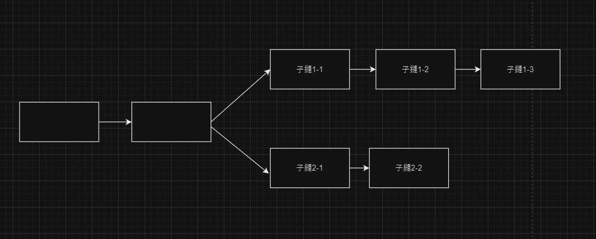

# 如何解決 Double Spending 問題 (UTXO，時間戳，分支)

<br>

---

<br>

## Double Spending 是甚麼 ?

在現有的電子支付技術領域中，有一個經典問題: __Double Spending__。

Double Spending 問題指的是同一筆資金被重複用於支付 2 次以上。先來看看目前中心化電商平台如何解決 Double Spending。

假設一個情境，一筆交易中共有 4 個角色參與其中:

* 買家
* 賣家
* 電商平台
* 銀行

<br>

交易過程如下:

1. 買家選擇商品並使用信用卡支付台幣給電商平台。
2. 電商平台把錢收到自己銀行帳戶中，並不會馬上支付給賣家，而是把錢暫時扣住。
3. 買家隔了 3 天，收到賣家寄出的貨物後確認沒問題，通知電商平台已經收貨了。
4. 電商平台將先前收到的帳款匯出給賣方銀行帳戶。

<br>

在這一過程中，電商平台相當於交易起初凍結了買方的錢，使其在交易完成前無法重複拿這筆錢去發起其他交易，從而解決 Double Spending。

<br>

一般的中心化電商平台擔任中介擔保人，但是去中心化的區塊鍊交易由誰來擔保就是另一個問題了。

<br>
<br>

__Bitcoin 系統解決 Double Spending 的 3 要素: UTXO,Timestamp, Fork__。

<br>
<br>

## UTXO (Unspent Transaction Output)

<br>

為了解決區塊了的 Double Spending 問題，中本聰為了 bitcoin 引入 UTXO (Unspent Transaction Output) 的概念，直譯成中文為 "未花費的交易輸出"，白話一點講就是 "電子紙鈔"。

一般中心化網銀轉帳的作法就是銀行系統端的 A B 帳戶水位增減，A 匯款給 B 1000 塊做法如下:

```
lock(A); // lock A's wallet
lock(B); // lock B's wallet

// throws exception if A's wallet sufficient not enough
sufficientCheck(A, 1000); 

// adjustment
A = A - 1000;
B = B + 1000;

// save A, B wallet 
save(A);
save(B);
```

<br>

__而 UTXO 則更像是傳統的紙鈔。__

所有人的錢包餘額在 bitcoin 系統中的錢都是很多個 UTXO  ( 一張一張的鈔票 ) 組成。有的 UTXO 面額是 1 BTC，有的是 0.5 BTC。這些不同面額的 UTXO 都是由之前的交易轉帳過來的，也有可能是挖礦獎勵所得。

每一個 UTXO 都是不可分割的 (沒人會把 100 塊紙鈔斯各一半說成是 2 張 50 塊)，錢包所擁有的這些 "一張一張" 的 UTXO 面額加總起來就是該錢包的餘額。

一個用戶的所有 UTXO ( "紙鈔" )，都分散在不同的 block 中，有的 block 可能會記錄一個用戶的多個 UTXO。

<br>

在 bitcoin 系統中，A 要轉帳 1.5 BTC 給 B，過程如下:

1. 從 A 所有的 UTXO 中找出足夠加總起來大於 1.5 BTC 的那幾個，也許是 `[0.1, 0.7, 0.9]` 這三個。

<br>

2. A 創建一筆交易，這筆交易會包含 A 這三個 UTXO 作為「輸入」(inputs)，並指定 B 為收款人，創建一個 1.5 BTC 的 UTXO 作為「輸出」(output) 給 B，以及一個 0.2 BTC 的找零 UTXO 給自己。

<br>

3. 當一個礦工收到 A 創建的這筆交易時，會做 3 個檢查:

    1. 在 UTXO 資料庫中查找是不是真的有 `[0.1, 0.7, 0.9]` 這三個 UTXO
    
    2. 找到後繼續檢查其擁有者 ( 這三個 UTXO 被生成時的收款人) 是不是 A，這是通過檢查發送方提供的數字簽名來完成的。
    
    3. 驗證這三個 UTXO 是否尚未被花費（未被用作其他交易的輸入）

    <br>

    如果通過了該檢查後，該礦工便會廣播發出確認訊息，一定量的礦工確認完成後，該筆紀錄將被記錄在鏈。如果未通過檢查則直接忽略。

<br>
<br>
<br>
<br>

## Timestamp

<br>

在第一個章節: [BitCoin blockchain 的 block 裡面長怎樣？](https://github.com/Johnny1110/Solidity_Note/blob/main/1_1/README.md) 提到區塊頭部有一個 Timestamp，它是由 Bitcoin 系統中的時間戳伺服器產生的。

使用 Timestamp 伺服器為每一筆交易賦予一個全平台統一的打包時間。這個時間並不是現實世界中的時間，而是以 BTC 網路誕生時開始計時的時間。當然，這個時間來源並不是某個礦工，或者交易方的個人設備的時間。

> 關於 Timestamp Server，首先交易本身的实际发生时间是不被记录的，另外区块的时间戳其实也只是记录区块创建的大概时间，也不能作为判断交易先后顺序的依据。比特币上的所谓的时间戳服务器，其实就是它的整个 POW 系统，因为这个系统可以保证系统上每十分钟就创建一个区块。同时系统会未每一个区块计算出哈希，每个区块中都保存着之前区块的哈希，有了这些哈希作为定位符，区块链就是一条单向的先后顺序明确的链条了。每个区块自然也就有了明确的先后顺序，同时也就是意味着里面包含的交易也都有了明确的交易顺序，这就是比特币时间戳服务器的基本原理。  引用文章-- [比特币的时间戳服务器 -- Binfo](https://happypeter.github.io/binfo/timestamp)

在整個區塊鏈中，所有區塊的時間戳是有序的，前一個區塊時間戳記必定小於後一個。而且每一個區塊頭部都會記錄前一個區塊的 Hash，如果某礦工惡意修改一個區塊的時間戳記，或者想在兩個區塊間插入一個作假區塊，那再對其進行 Hash 驗證時就會被發現。

Timestamp 在解決 Double Spending 問題時的起到的作用是如果一個 UTXO 被用於支付 2 次，礦工只會選擇認時間戳記較小的 ( 先發生 ) 那一個。

<br>
<br>
<br>
<br>


## Fork (分支)

<br>

如果一個用戶在短時間內用一個 UTXO 進行 2 次支付，那該 UTXO 的記帳處理有可能會分別由 2 個礦工執行。由於記帳時礦工們不會馬上知道另一筆交易的存在，於是便會分裂成 2 個不同子鏈:


<br>

不同礦工會根據廣播傳遞順序先後不同，各自選擇在其中一個分支上鏈上記帳，隨時間推移，兩個鏈的長度就會有差異，當 Follow 較短那條鏈的礦工們發現另一邊的鏈更長時，會選擇直接把更長的鏈複製過來，改 Follow 更長的那一條鏈。


(礦工們會優先 Follow 子鏈 1)

這樣一來，當初造成分支的那一個 UTXO 最終去向則是由更長的那一條鏈說了算。

<br>

以上的分支只是臨時分支。最終會還是合併成一個唯一鏈。還有一種分支叫做 soft fork (軟分支)。就是當 bitcoin 系統進行版本升級時，由於部分的礦工已升級，另一些還沒來的及升，導致礦工版本不一樣從而產生分歧。老版本礦工不接納新版本礦工產生的區塊，從而產生新老兩個分支，這種分支被稱作 soft fork (軟分支)。當所有節點都升級成新版後，最終新老分支也會合併成一個分支。

還有一種永遠不會合併的分支，叫做 hard fork (硬分支)。當礦工們意見出現分歧時產生 2 條鏈，並且 Follow 不同鏈的礦工們互相不承認對方，無法得到共識，就會形成無法合併的硬分支。這種硬分支發生後基本上就相當於一個時間軸分裂出 2 個平行宇宙。相對應的也就會變成 2 種虛擬貨幣。

硬分支舉例: 在 2016 發生重擊乙太訪與幣圈的 The DAO 事件，與其衍生分支貨幣 ETC (乙太經典) 的相關文章與影片:

> [当年让以太坊分叉的The DAO事件是怎么回事？ -- 吉说区块链](https://www.bilibili.com/video/BV1BR4y1x7AK/?spm_id_from=333.337.search-card.all.click&vd_source=9780a181ac9f1fee5f680f255ee5bc73)

> [DAO遭駭事件打破區塊鏈不可逆神話 -- 沈庭安](https://www.ithome.com.tw/news/107405)


<br>

## 補充學習資料:

Youtube Video: [Soft Fork vs Hard Fork in Crypto (ETH Classic, Litecoin, BTC Cash...) -- 
Whiteboard Crypto
](https://www.youtube.com/watch?v=Bu1GcyyFZ7w)


