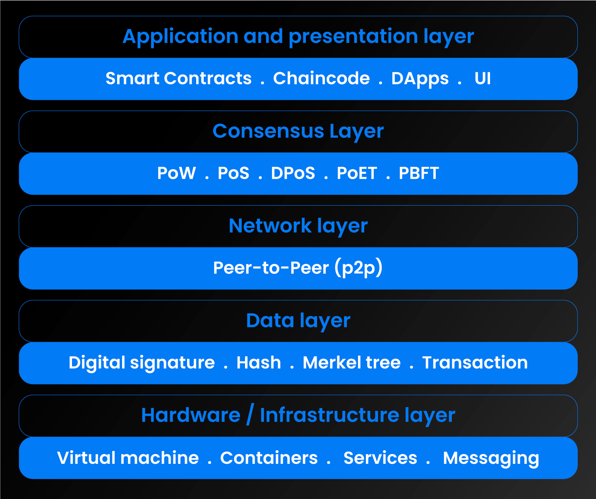

# 區塊鏈 5 層架構設計 （另補充：側鏈，公有鏈，私有鏈概念）

 

---

 

__區塊鏈應用的架構分為 5 個 Layer:__

> Source: [layers-of-blockchain-explained -- LCK](https://www.lcx.com/layers-of-blockchain-explained/)

 

## 基礎層（Hardware Layer）：

這一層包括區塊鏈運行所需的硬體基礎設施，如伺服器、網絡設備等。所有的設備都是一個 Node，他們之間可以 P2P 的共享資料，所有的 Node 聯合起來就是一個區塊鏈。

 

## 數據層（Data Layer）：

在硬體層之後是數據層，這一層存儲交易詳情資訊。

記錄在區塊上的交易信息包括:

* 發送的加密貨幣的信息
* 接收者的公鑰
* 發送者的私鑰 (公私鑰概念之後非對稱加密篇章會詳細介紹)

每個區塊都與前一個區塊以及下一個將生成的區塊相連接（靠區塊頭的 Hash 指針實現）。

 

## 網絡層（Network Layer）：

這一層實現區塊鏈節點之間的 P2P 通信。它連接節點、並在整個網絡中廣播交易資料。

由於區塊鏈是一個開放系統，每個節點都必須了解其他節點正在驗證的交易。網絡層促進了這種通信。

 

## 共識層（Consensus Layer）：

這一層保證區塊鏈網路中的所有 Node 對每筆交易的有效性達成一致。它使用共識機制，如工作量證明（PoW）或權益證明（PoS），來驗證並將交易添加到區塊鏈中。

還有一種常用的共識算法 -- __Vote__，由 Node 投票型成共識。

 

## 應用層（Application Layer）：

這一層包括智能合約、去中心化應用程序（dApps）以及運行在區塊鏈網路上的其他軟體。它允許開發者利用區塊鏈的安全性和透明度。

這些應用包括像是錢包、社交媒體應用（真的有去中心化社交軟體 ex:Damus）、Web3 瀏覽器 、去中心化金融（Defi）應用和 NFT 平台等等。

雖然這些應用的 UI/UX 與任何其他中心化應用相同都需要架設專用伺服器，但這些應用的後端資料存儲是去中心化的。

 

## 應用層的補充

### 側鏈（Side Chain）

應用層中的側鏈應用是對區塊鏈的完善補充，主鏈上沒有的功能可以在側鏈上實現，如果主鏈運行效率比較差，也可以將主鏈的部分功能轉移到側鏈上實現，進而分擔主鏈壓力。

例如 Polygon 區塊鏈就是以太訪 mainnet 的側鏈，它們兩個是完全各自獨立運行的網路，但是他們透過雙向橋接建立了連接，讓主鏈與側鏈之間的數位資產或代幣可以無縫轉移。（這就是為什麼 USDT 是使用以太訪智能合約發行的代幣卻可以在交易所中看到支援一堆側鏈轉帳）

這些側鏈相比主鏈更不壅擠，且一個區塊所乘載的交易可以更多，所以交易手續費更低且確認速度更快。當然，側鏈的幣可以回到主鏈上就保證了在側鏈交易最其本的保障。

>側鏈是獨立的區塊鏈，透過雙向橋接與主區塊鏈相連，使得資產能在其間流通。側鏈能夠獨立運作，具備獨特的共識機制和區塊參數，有助於高效處理交易並為特定目的進行客製化。側鏈提供了可擴展性、靈活性和與以太坊虛擬機 (EVM) 的相容性，但也伴隨著一些代價，包括可能對去中心化帶來挑戰，以及對嚴格安全措施的需求。 -- [什麼是側鏈？ -- 幣安](https://academy.binance.com/zt/articles/what-are-sidechains)

 

### 公有鏈、私有鏈、聯盟鏈

發展初期的區塊鏈，應用上基本都是公有鏈應用，這代表所有人都可以參與其中，這堆一些私人機構跟企業很不友好，畢竟一些公司內部或者產業聯盟的資料要上公有鏈的話，所有人都能看到。另外公有鏈交易使用的是像 ETH 這種加密貨幣價值浮動過大，很難去控制成本。

後面慢慢出現了一些保障存取權控制與安全保障的區塊鏈，可以解決企業間使用的問題，產業上下游訂單等訊息傳遞改用區塊鏈記帳方式來做，既高效率又對雙方有保障。這些私有鏈由參與的企業一起維護。

* 公有鏈：

    任何人都可以參與，例如 ETH 的 mainnet，大家可以讀取區塊中的資料，發起交易，作為節點礦工參與記帳。

    公有鏈可以最大程度實現去中心化（畢竟 node 多。但是也因為 node 太多，所以效能比較差。

 

* 私有鏈：

    私有鏈由特定組織管控，整個區塊鏈網路中的節點都是由該組織的成員組成。__共識算法由指定的一個節點礦工完成__。私有鏈只有一定程度的實現去中心化。通常是在一個企業內部自己使用。

    私有鏈可以保護企業資料不外流，且因為節點少，交易幾乎沒有延遲，而且 0 手續費。

 

* 聯盟鏈：

    聯盟鏈由幾個機構一起組成，使用於業務合作公司之間的交易，訂單結算等的 B2B 應用場景。(如 Hyperledger Fabric)

