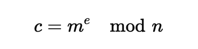
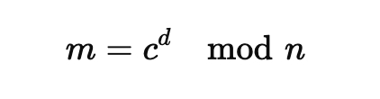

# 對稱/非對稱加密 （附數學推導生成密鑰與加解密過程）

<br>

---

<br>

## 對稱式加密

<br>

對稱式加密是 __使用同一把密鑰對資料進行加解密__，常用的對稱加密算法包括：

* DES (Data Encryption Algorithm)

* 3DES (Triple DES)

* AES (Advanced Encryption Standard)

對稱加密算法優點是算法公開，計算量小，加密速度快，加密效率高。缺點是一但密鑰失竊，加密資料就會被公開，也無法確認消息是誰發出的，因為真正的密鑰真正的主人跟竊賊都使用同樣密鑰。

區塊鏈中不會使用對稱加密算法。

<br>

## 非對稱式加密

非對稱式加密就是加解密雙方使用不同的密鑰進行資料交互。這一對密鑰被稱作 公鑰（public key）私鑰 (private key)。非對稱式加密可以加密要傳遞的資料，也可以驗證數位簽章，保證不可否認性。

__私鑰只有擁有者才知道__，__公鑰由私鑰當參數計算生成，且是公開的。__

公鑰加密只能私鑰解密，私鑰加密也只能由公鑰解密，加解密需要非對稱的兩把鎖才能完成，所以叫做 "非對稱加密"。

先講一下公私鑰的使用情境之後，再介紹一下公私鑰生成過程。

<br>

### 使用情境


<br>


### Scenario: 消息發送方 B 發送一個消息 給 A。

1. B 將消息使用 A 的公鑰加密，變成加密字串。同時對消息原始明文進行一次 HASH 壓碼。然後使用自己的私鑰對 HASH 值進行加密形成數位簽章。

2. 透過網路傳遞 __加密字串__，__數位簽章__ 給 A。

3. A 收到資料後，先把加密字串用自己的私鑰解密得到消息明文。然後針對數位簽章使用 B 的公鑰解密得到 HASH 值。

    為了驗證消息的發送方真的是 B，對明文消息進行一次 HASH，比對這個 HASH 是不是跟數位簽章解密後的內容一致。

<br>

以上就是非對稱式加密的使用情境。

<br>
<br>
<br>
<br>

## 擴充知識：公私鑰的產生與加解密過程

<br>

Asymmetric cryptography 非對稱密碼學

<br>

這邊我們將研究並解析非對稱加密中比較知名的實現之一：RSA 公私鑰的生成與加解密技術內幕。

<br>

### RSA Key 的生成

<br>

1. 選擇兩個主要的數字 p 與 q

    ```
    p = 61
    q = 53
    ```

    <br>


2. 計算 p q 乘積 n:

    ```
    n = p * q // n = 3233
    ```

    n = 3233

    <br>

3. 計算由拉數 Euler's totient function ϕ(n)

    ```
    ϕ(n) = (p-1)*(q-1)
    ```

    ϕ(n) = (61-1)*(53-1) = 3120

    <br>

4. 選擇一個公鑰指數 `e`，且 `e` 需要滿足以下條件：

    1. e 必須與 ϕ(n) 互為質數，且必須小於 ϕ(n)。 

        ps: 如果兩個或兩個以上的整數的最大公因數是1，則稱它們為互質

        這邊選 __e = 17__

    <br>

5. 選擇一個私鑰指數 `d`:

    使用 Extended Euclidean Algorithm 計算出 `d`:

    目前我們的 `e = 17`, `ϕ(n) = 3120`


    e*d 除以 ϕ(n) 餘數要等於 1:

    ```
    (17 * d) mod 3120 = 1
    ```

    得出 `d = 2753`

    <br>

    目前目前我們得出了一對公私鑰：

    * Public Key (e, n) -> Public Key (17, 3233)
    * Private Key (d, n) -> Private Key (2753, 3233)


    <br>
    <br>
    <br>
    <br>

### 使用公鑰加密：

<br>

加密一個 message 下面以 `m` 代替。

1. 把 `m` 變成數字且 `0 <= m < n`

2. 用公式計算密文 c：

    

    假設 m 是 65，我們要把 65 進行加密：

    ```
    c = (65^17) % 3233
    ```

    得到密文 `c = 2790`


<br>
<br>
<br>
<br>

### 使用密鑰解密：

1. 使用公式計算明文 m：

    

    已知密文是 `c = 2790`

    ```
    m = (2790^2753) % 3233
    ```

    得到明文 `m = 65`


<br>
<br>
<br>
<br>

### RSA 實現總結

<br>

1. 公私鑰的生成需要選擇兩個數字 `p` 與 `q`，然後計算 `n` 與 `ϕ(n)`，並進一步算出公鑰用的 `e` 與 私鑰用的 `d`。

2. 使用公鑰 `key(e, n)` 加密明文 `m` 得到密文 `c`: `c = (m^e) % n`

3. 使用私鑰 `key(d, n)` 解密密文 `c` 得到明文 `m`: `m = (c^d) % n`

<br>

當我們持有某人的公鑰時，我們是有機會可以透過計反推出他的私鑰的，不過要知道他建立公私鑰時的 p 與 q 是多少。

當然，實際上的 RSA `p` 與 `q` 的選擇一定不會只是簡單的 61 與 53 這樣而已。選擇的數字越大就越難破解。這就是目前 RSA 加密算法安全的保障。

