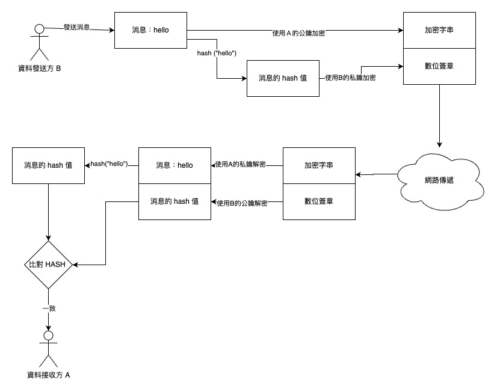

# 對稱/非對稱加密

 

---

 

## 對稱式加密

 

對稱式加密是 __使用同一把密鑰對資料進行加解密__，常用的對稱加密算法包括：

* DES (Data Encryption Algorithm)

* 3DES (Triple DES)

* AES (Advanced Encryption Standard)

對稱加密算法優點是算法公開，計算量小，加密速度快，加密效率高。缺點是一但密鑰失竊，加密資料就會被公開，也無法確認消息是誰發出的，因為真正的密鑰真正的主人跟竊賊都使用同樣密鑰。

區塊鏈中不會使用對稱加密算法。

 

## 非對稱式加密

非對稱式加密就是加解密雙方使用不同的密鑰進行資料交互。這一對密鑰被稱作 公鑰（public key）私鑰 (private key)。非對稱式加密可以加密要傳遞的資料，也可以驗證數位簽章，保證不可否認性。

__私鑰只有擁有者才知道__，__公鑰由私鑰當參數計算生成，且是公開的。__

公鑰加密只能私鑰解密，私鑰加密也只能由公鑰解密，加解密需要非對稱的兩把鎖才能完成，所以叫做 "非對稱加密"。

先講一下公私鑰的使用情境之後，再介紹一下公私鑰生成過程。

 

### 使用情境

 

### Scenario: 消息發送方 B 發送一個消息 給 A。

1. B 將消息使用 A 的公鑰加密，變成加密字串。同時對消息原始明文進行一次 HASH 壓碼。然後使用自己的私鑰對 HASH 值進行加密形成數位簽章。

2. 透過網路傳遞 __加密字串__，__數位簽章__ 給 A。

3. A 收到資料後，先把加密字串用自己的私鑰解密得到消息明文。然後針對數位簽章使用 B 的公鑰解密得到 HASH 值。

    為了驗證消息的發送方真的是 B，對明文消息進行一次 HASH，比對這個 HASH 是不是跟數位簽章解密後的內容一致。

 

以上就是非對稱式加密的使用情境。

 
 
 
 

## 擴充知識：公私鑰的產生與加解密過程

 

log // TODO

