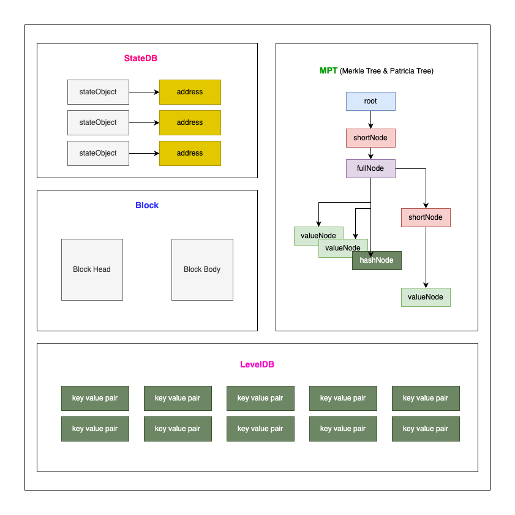
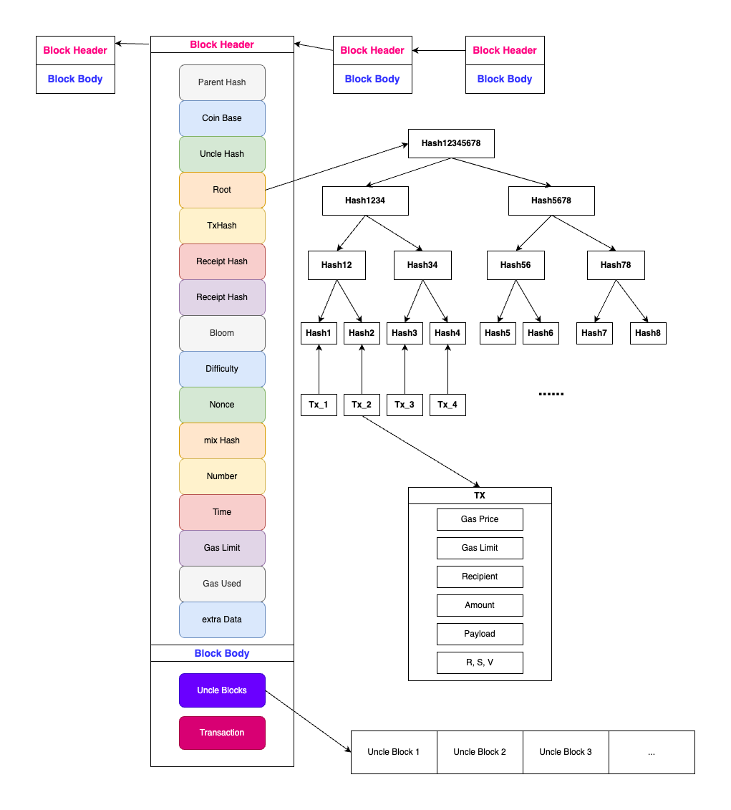

# 以太坊區塊鏈 (資料結構)

 

---

 

以太坊的資料儲存可以分為 3 種:

1. __狀態資料__: 以太坊帳戶相關的狀態資料，使用 StateDB 儲存與管理帳戶，每一個帳戶都是一個 StateObject。

2. __區塊鏈__: 以太坊的核心資料，跟 bitcoin 很像但又有一點進化。

2. __底層資料__: 儲存全部的以太坊資料，以 key-value 的形式存於 LevelDB 中。

 

---

Tips: 
    
以太坊資料儲存在 LevelDB 中。

LevelDB 是 Google 推出的一款 key-value database。

目前以太坊中共有 3 個 LevelDB，分別是 BlockDB, StateDB, ExtrasDB。

* BlockDB: 保存區塊主體內容 (包括區塊頭部，與區塊體)。
* StateDB: 保存帳號狀態資料。
* ExtrasDB: 保存交易收據資料以其其他輔助資料。

---

 
 

## 以太坊資料結構

 

 

### 狀態資料

狀態資料以 MPT 的形式儲存在 StateDB 中。MPT 是兼具 Merkle Tree & Patricia Tree 特點的一種新的樹狀資料結構。

MPT 特點：

* 可以儲存任意長度的 key-value pairs。
* 具備 Merkle Tree 的特點，可以用於節點快速校驗。
* 能夠很快速的根據 key 查到 value。

MPT 中包含 shortNode，fullNode，valueNode 還有 hashNode 這四種節點。

shortNode 與 fullNode 是分枝節點，他們可以有個自的子節點。但要注意 shortNode 只能有一個子節點，而 fullNode 可以有多個。

valueNode 與 hashNode 是葉子節點。valueNode 用於儲存資料，值為從 root 節點到當前節點的路徑上所有節點的 key 之合。hashNode 用於儲存資料庫中其他節點的 hash 值。

 

### 區塊鏈

ETH 區塊鏈的結構有 2 點與 BTC 區塊鏈相同：

1. ETH 區塊鏈也是由父區塊的 hash 值將區塊連接在一起（指向前一個區塊的指針）。

2. ETH 區塊鏈也是由區塊頭跟區塊體組成。區塊頭與區塊體結構如下：

 

__上圖中出現的名詞說明__：

* ParentHash: 父區塊的 Hash 值。

* CoinBase: 幣基地址，礦工的錢包地址（挖出區塊的獎勵接收者）。

* UncleHash: 當前區塊引用的叔叔區塊集合的 Merkle 數根 Hash。叔叔區塊是以太坊的特色之一。

    bitcoin 每 10 分鐘左右才能產生一個新區塊，當兩個礦工幾乎同時找到新區塊時，由於網絡傳播的延遲，部分礦工可能首先接收到 A 礦工的區塊，另一些礦工可能先接收到 B 礦工的區塊。結果是網絡中暫時出現兩條區塊鏈分支。
    礦工們通常會遵循它們首先收到的區塊，並將其視為主鏈的一部分，然後礦工們開始繼續在所接收的區塊上進行挖礦，形成兩個分支各自延續的情況。

    __比特幣解決分叉的方式__：

    * __長鏈原則（Longest Chain Rule）__：

        * 比特幣協議規定，節點會認為工作量證明（Proof of Work）最長的鏈是正確的主鏈。

        * 當新的區塊被加入其中一條鏈後，該鏈變得更長，其它節點會切換到該更長的鏈。
    
    * __孤塊（Orphan Block）__：

        * 較短的鏈（即未被選擇的鏈）上的區塊稱為「孤塊」，不再被網絡承認。孤塊中的交易會返回到內存池中，等待重新被打包到主鏈的區塊中。

    * __處理孤塊的影響__：

        * 交易不丟失：被包含在孤塊中的交易（未在其他區塊中確認的交易）會被返回到網絡的內存池中，等待其他礦工再次打包。
        
        * 礦工的損失：挖出孤塊的礦工無法獲得該區塊的區塊獎勵和交易手續費。
        
        * 網絡一致性：一旦網絡回到單一主鏈，所有節點達成共識，分叉自然消失。

    當兩個礦工幾乎同時挖出區塊時，比特幣網絡會暫時分叉，但基於「長鏈原則」，最終一條分支會被選為主鏈，另一條分支成為孤塊而被放棄。這種機制保證了區塊鏈的一致性和安全性。

     

    回來看以太坊：

    以太坊叔叔塊是指那些被有效挖出但未成為主鏈一部分的區塊，與比特幣中的「孤塊」不同，叔叔塊仍然能獲得一定的區塊獎勵。
    
    以太坊遇到暫時性分岔處理過程如下：
    
    1. __確認主鏈__：

        如果出現暫時分叉，礦工最終會選擇基於「長鏈原則」的主鏈。
    
    2. __叔塊獎勵__：

        被排除在主鏈之外的叔叔塊仍然可以提交到網絡，並獲得一定比例的獎勵（離主鏈越近的叔塊獎勵越高）。
        包含叔叔塊的主鏈區塊的礦工也能獲得額外的獎勵 (一個主鏈區塊最多可以有 __2 個__ 叔叔塊，多少還是要限制一下產量)。
    
    3. __網絡一致性__：

        因為叔叔塊仍然有價值，礦工的算力競爭不會完全浪費，這減少了因分叉導致的資源浪費。

     

* Root: StateDB 中 MPT 的樹根 Hash 值。MPT 中存有所有以太坊帳戶資料。

* TxHash: 交易集合的 Merkle 數根 Hash，所有交易打包到一個區塊中後會形成這個樹根。

* ReceiptHash: 紀錄所有收據資料的 MPT 樹根 Hash 值，Receipt 中的紀錄包含交易被包在哪個區塊，這筆交易花費多少 Gas，以及一些交易 log。

* Bloom: 用於快速搜尋與判斷一個 log 是否存在於 Receipt 中。

    > 補充：Bloom Filter 是一種空間效率很高的數據結構，用於快速檢索特定事件是否在交易執行日誌（Logs）中。

* Difficulty: Pow 共識算法中挖礦難度的 factor。

* Nonce: 它是礦工通過不斷變化來滿足挖礦條件的隨機數，與 MixHash 一起證明工作量的合法性。

* MixHash: 挖礦計算過程中生成的最終隨機值，用於驗證這個區塊是否滿足 PoW 要求。

* Number: 區塊編號。

* Time: 生成區塊的時間戳。

* GasLimit: 該區塊可容納的最大 Gas 量，防止單一區塊因過多交易導致處理過於緩慢。

* GasUsed: 區塊中實際消耗的 Gas，通常低於或等於 GasLimit。

* extraData: 留給區塊的建立者紀錄自定義訊息，長度小於 32 bytes。

 

__交易由下幾個參數組成__：

* GasPrice: Gas 的價格，單位是 wei，GasPrice 越高越優先被礦工打包。

* GasLimit: 設置執行合約或交易的資源使用上限，防止無法完成交易時資源浪費。

* Recipient: 交易收據。

* Amount: 交易金額。

* Payload: 包含執行合約的具體資料，對於部署智能合約的交易尤為重要。

* R,S,V: 交易簽名。

 

